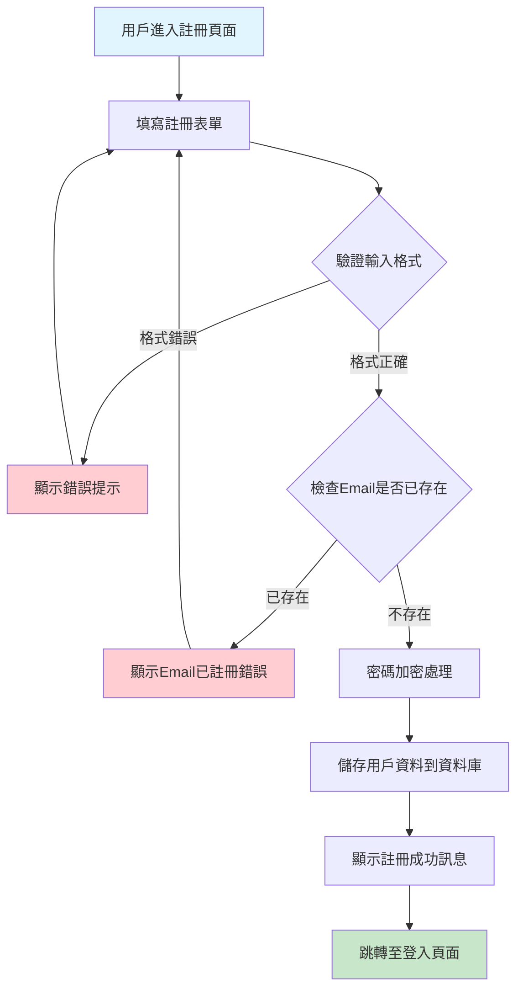
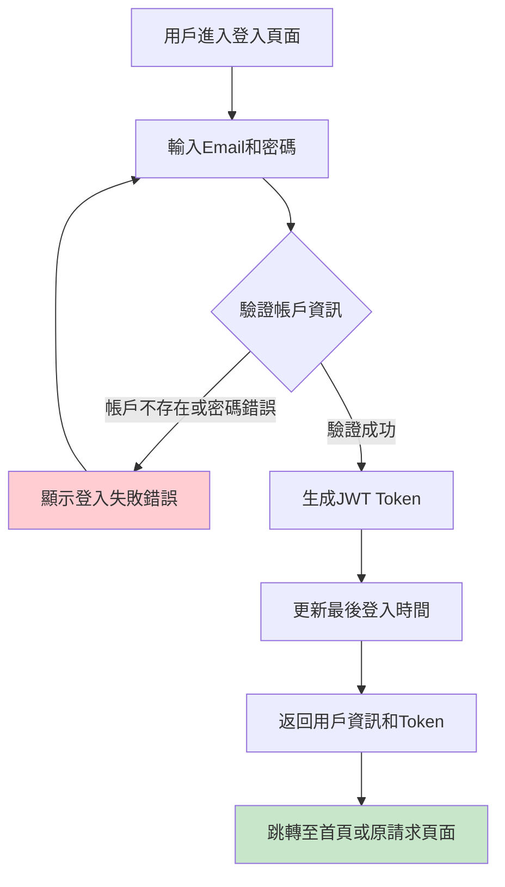
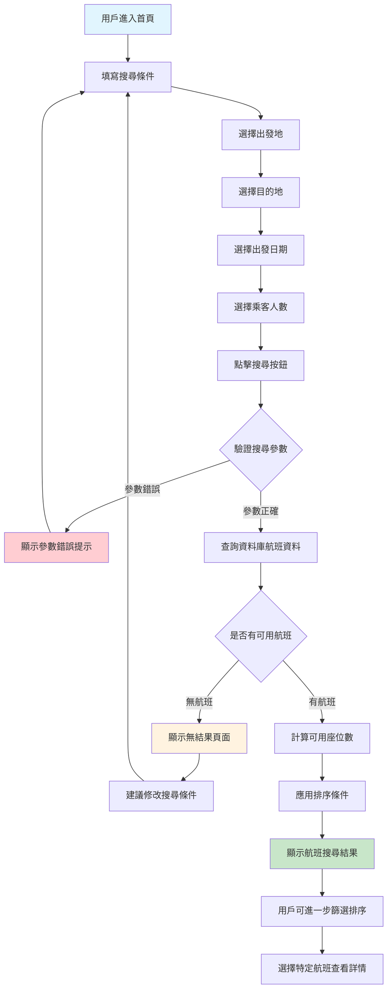
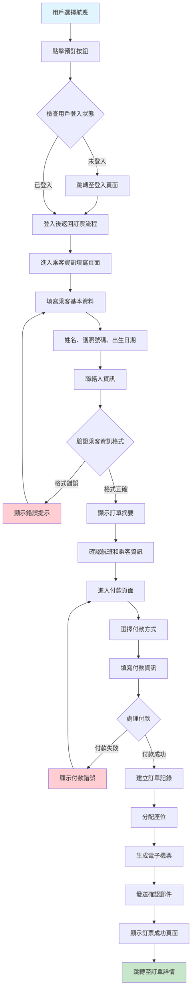
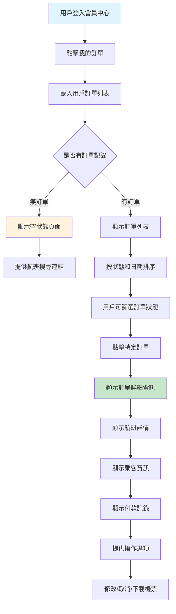
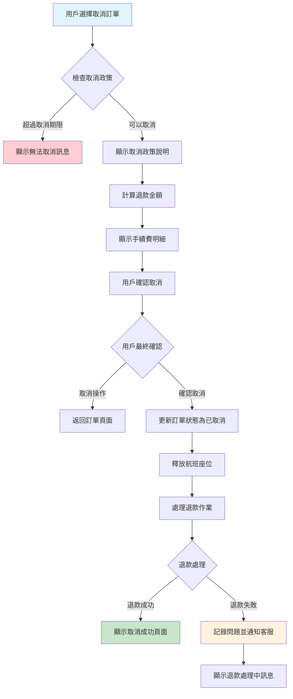
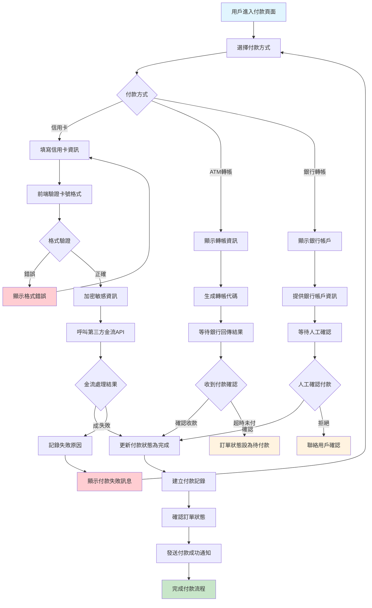
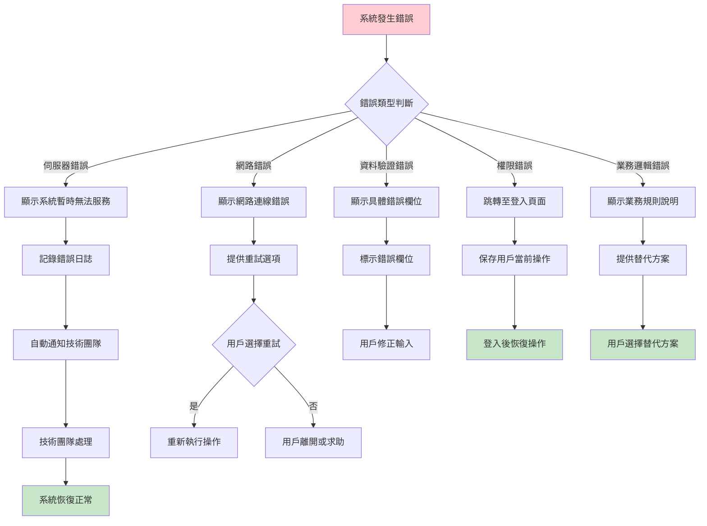
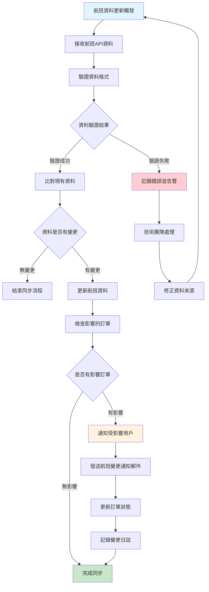

# 奇異鳥航空訂票網站 - 系統流程圖文件

## 文件資訊

- **文件名稱：** 奇異鳥航空訂票網站 系統流程圖文件
- **版本：** v1.0
- **撰寫人：** SA
- **日期：** 2025-07-17
- **文件狀態：** Draft

---

## 1. 用戶註冊流程圖



**流程說明：**

1. 用戶填寫基本資料（姓名、Email、密碼、手機）
2. 前端驗證輸入格式（Email 格式、密碼強度）
3. 後端檢查 Email 唯一性
4. 密碼使用 bcrypt 加密儲存
5. 註冊成功後直接可使用帳戶登入

---


## 2. 用戶登入流程圖




**安全機制：**

- JWT Token 有效期 1 小時
- 記錄登入 IP 和時間
- 統一錯誤訊息防止帳戶探測

---

## 3. 航班搜尋流程圖




**搜尋優化：**

- 快取熱門路線搜尋結果 15 分鐘
- 支援模糊搜尋機場名稱
- 自動建議替代日期和機場

---

## 4. 完整訂票流程圖




**重要檢查點：**

1. **航班可用性：** 確認選購時航班仍有座位
2. **資料驗證：** 護照格式、日期有效性
3. **付款安全：** PCI DSS 規範，信用卡資訊加密
4. **庫存控制：** 防止超賣機制

---

## 5. 訂單管理流程圖

### 5.1 查看訂單流程




### 5.2 修改訂單流程

```mermaid
flowchart TD
    A[用戶選擇修改訂單] --> B{檢查訂單狀態}
    B -->|無法修改| C[顯示修改限制訊息]
    B -->|可以修改| D[顯示可修改選項]
    D --> E[修改日期/修改乘客資訊]
    E --> F{選擇修改類型}
    F -->|修改日期| G[搜尋替代航班]
    F -->|修改乘客| H[編輯乘客資訊]
    G --> I[顯示可用替代航班]
    I --> J[計算價差和手續費]
    J --> K[用戶確認修改]
    H --> K
    K --> M{處理額外付款}
    M -->|需要付款| N[進入付款流程]
    M -->|無需付款| O[直接更新訂單]
    N --> P{付款是否成功}
    P -->|失敗| Q[取消修改操作]
    P -->|成功| O
    O --> R[更新訂單資料]
    R --> S[重新分配座位(如需要)]
    S --> T[顯示修改成功頁面]

    style A fill:#e1f5fe
    style T fill:#c8e6c9
    style C fill:#ffcdd2
    style Q fill:#ffcdd2
```


### 5.3 取消訂單流程




## 6. 客服工單處理流程圖

```mermaid
flowchart TD
    A[用戶進入客服頁面] --> B[查看常見問題FAQ]
    B --> C{FAQ是否解決問題}
    C -->|問題已解決| D[用戶結束流程]
    C -->|未解決| E[填寫問題表單]
    E --> F[選擇問題分類]
    F --> G[填寫問題詳細描述]
    G --> H[提供聯絡資訊]
    H --> I[關聯相關訂單(可選)]
    I --> J[提交工單]
    J --> K[系統自動分配工單編號]
    K --> L[根據分類分配給客服人員]
    L --> M[發送工單建立確認郵件]
    M --> N[客服人員處理工單]
    N --> O{需要更多資訊}
    O -->|是| P[客服回覆請求更多資訊]
    O -->|否| Q[客服提供解決方案]
    P --> R[用戶補充資訊]
    R --> N
    Q --> S[更新工單狀態為已解決]
    S --> T[發送解決方案郵件]
    T --> U[用戶確認問題已解決]
    U --> V[關閉工單]

    style A fill:#e1f5fe
    style D fill:#c8e6c9
    style V fill:#c8e6c9
```


**工單優先級規則：**

- **緊急：** 影響行程的問題（起飛前 24 小時）
- **高：** 付款問題、系統錯誤
- **中：** 一般查詢、訂單修改
- **低：** 建議反映、非緊急問題

---

## 7. 付款處理流程圖




**安全措施：**

- 信用卡號碼前端遮罩顯示
- 敏感資料 SSL/TLS 加密傳輸
- 符合 PCI DSS 安全標準
- 付款超時機制（15 分鐘）

---

## 8. 系統錯誤處理流程圖




**錯誤監控機制：**

- 即時錯誤日誌記錄
- 自動告警系統
- 錯誤率監控 dashboard
- 用戶體驗追蹤

---

## 9. 資料同步流程圖




**同步策略：**

- 每小時自動同步航班狀態
- 即時接收重要變更（取消、延誤）
- 資料衝突自動解決機制
- 保留歷史變更記錄

---

✏️ _最後更新時間：2025-07-17_
